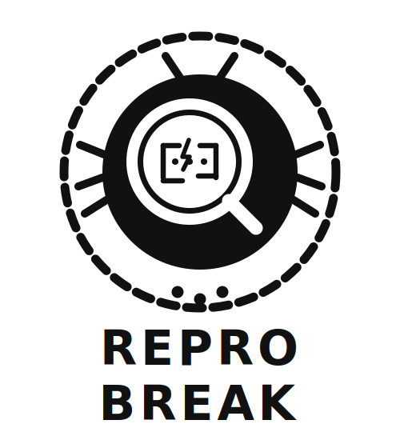

<p align="center">
  
</p>


<p align="center">
 ReproBreak: A Dataset of Reproducible Web Locator Breaks
</p>

---


## Requirements

| Tool | Version |
|:---|:---|
| Python | 3.10+ |
| Git CLI | any |
| Docker | with Compose |
| uv *(recommended)* | latest |

---

## Setup

### 1. Clone the repository

```bash
git clone https://github.com/rub-sq/ReproBreak
cd ReproBreak
```

### 2. Download the dataset

Download the pre-built database from Google Drive:

> **[Download locator_break.db](<GOOGLE_DRIVE_LINK>)**

Unzip and place it in the `data/` folder:

```bash
unzip locator_break.zip -d data/
```

### 3. Install dependencies

```bash
uv sync
```

<details>
<summary>Using pip instead</summary>

```bash
pip install -e .
```

</details>

---

## Reproducing a Locator Break

Reproduce any locator break from the dataset by its ID:

```bash
python reproduce.py --locator_id <ID> --mode <MODE>
```

| Mode | Behaviour |
|:---|:---|
| `reproduce_break` | Reverts locator to old value — test is expected to **fail** |
| `fixed` | Runs with current (fixed) locator — test is expected to **pass** |
| `overwrite` | Runs tests without modifying the locator |

**Example:**

```bash
python reproduce.py --locator_id 42 --mode reproduce_break --db data/locator_break.db
```

---


## Project Structure

```
reprobreak/
├── reproduce.py                     # Reproduce a locator break
├── create_dataset.py                # (Optional) Phase 1: Mine locator changes
├── create_reproducible_dataset.py   # (Optional) Phase 2: Verify reproducibility
├── save_reproduction.py             # (Optional) Phase 3: Store results in DB
├── config.py                        # Global configuration
├── database/
│   └── schema.sql                   # SQLite schema
└── data/
    ├── locator_break.db             # Dataset (download separately)
    └── reproduction_files/          # Per-repo reproduction environments
```

---


## Building the Dataset *(optional)*

<details>
<summary>Click to expand</summary>

The pre-built database covers 200+ repositories. To extend or rebuild it from scratch:

**Phase 1 — Mine locator changes**
```bash
python create_dataset.py
```

**Phase 2 — Verify reproducibility**

Place a `Makefile` with `start`, `test`, `stop`, and `setup-e2e` targets under `data/reproduction_files/repos/<repo-name>/`, then run:
```bash
python create_reproducible_dataset.py
```

**Phase 3 — Save results**
```bash
python save_reproduction.py
```

Key settings in [`config.py`](config.py): `REPO_LIST`, `START_WITH_CLEAN_DB`, `PARALLEL_CONTAINERS`, `DELETE_REPO_AFTER_ANALYZE`.

</details>

---